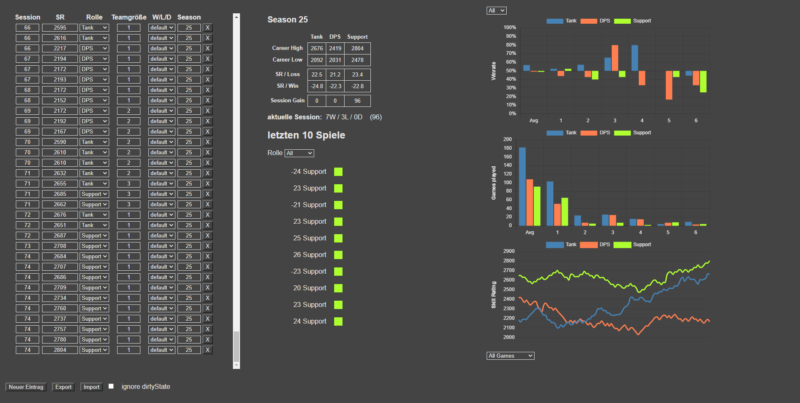

# OverwatchWebApp
A Web App using local Storage to track SR progress in Overwatch and evaluate it

 * [Usage](#usage)
 * [Libraries](#libraries)

 

## Usage

Generally you declare your placements via `Win`, `Loss` and `Draw` with a SR of `0`. For the last placement game enter your final placement SR. Afterwards games are declared via default.
 * __default__: evaluates based on the games before whether this game is a win loose or draw. This is used after the placements are done.
 * __Win__: Declares this game as a win regardless of its sr diff to the last game. This is used for the placement matches.
 * __Loss__: Declares this game as a loss regardless of its sr diff to the last game. This is used for the placement matches.
 * __Draw__: Declares this game as a draw regardless of its sr diff to the last game. This is used for the placement matches.
 * __noCount__: This match is ignored in the stats. This is used for sr penalties or corrections.

## Libraries
 * Chart.js [github.com/chartjs/Chart.js](https://github.com/chartjs/Chart.js)
 * Github Corners [github.com/YunYouJun/wc-github-corners](https://github.com/YunYouJun/wc-github-corners)
 * Vue.js [github.com/vuejs/vue](https://github.com/vuejs/vue)
 * Vuex [github.com/vuejs/vuex](https://github.com/vuejs/vuex)
 * vue-chartjs [github.com/apertureless/vue-chartjs](https://github.com/apertureless/vue-chartjs)
 * BootstrapVue [github.com/bootstrap-vue/bootstrap-vue](https://github.com/bootstrap-vue/bootstrap-vue)
 * Bootstrap [github.com/twbs/bootstrap](https://github.com/twbs/bootstrap)
 * Feather Icons [github.com/feathericons/feather](https://github.com/feathericons/feather)
 * lodash [github.com/lodash/lodash](https://github.com/lodash/lodash)
 * dark-mode-toggle [github.com/H0rn0chse/dark-mode-toggle](https://github.com/H0rn0chse/dark-mode-toggle)